<div align="center">


# Coclico

### A Windows desktop companion for everyday system care

[](https://dotnet.microsoft.com/)
[](#requirements)
[](LICENSE.txt)

[English](README.md) · [Français](README_FR.md) · [Developer (EN)](READMEDEV.md) · [Developer (FR)](READMEDEV_FR.md)

</div>

---

## What is Coclico?

Coclico is a Windows desktop application that brings system information and maintenance tools together in one modern WPF interface. Its goal is to make common tasks easier to find, understand, and review **before** they change the computer.

> **A solo project, and a living one.** Coclico is developed by a single person, in their free time. The project keeps moving forward, but updates may be spaced out depending on available time: don't worry, it is very much alive and will keep evolving.

## AI assistance disclosure

I created and maintain Coclico on my own; the product direction and implementation decisions are mine. I use AI transparently as a helper: to correct and structure my texts in both French and English (I live with dyslexia and dysorthographia, a spelling disorder that makes some mistakes hard to catch), to investigate bugs and persistent errors, to work through problems I do not fully understand yet, and to better grasp technical topics such as .NET 10. AI suggestions may have informed code changes; I review and take responsibility for the work integrated into the project. I therefore do not present Coclico as a project created without AI assistance, and I prefer to state it clearly.


A welcome message introduces the application on first launch:

<p align="center">
  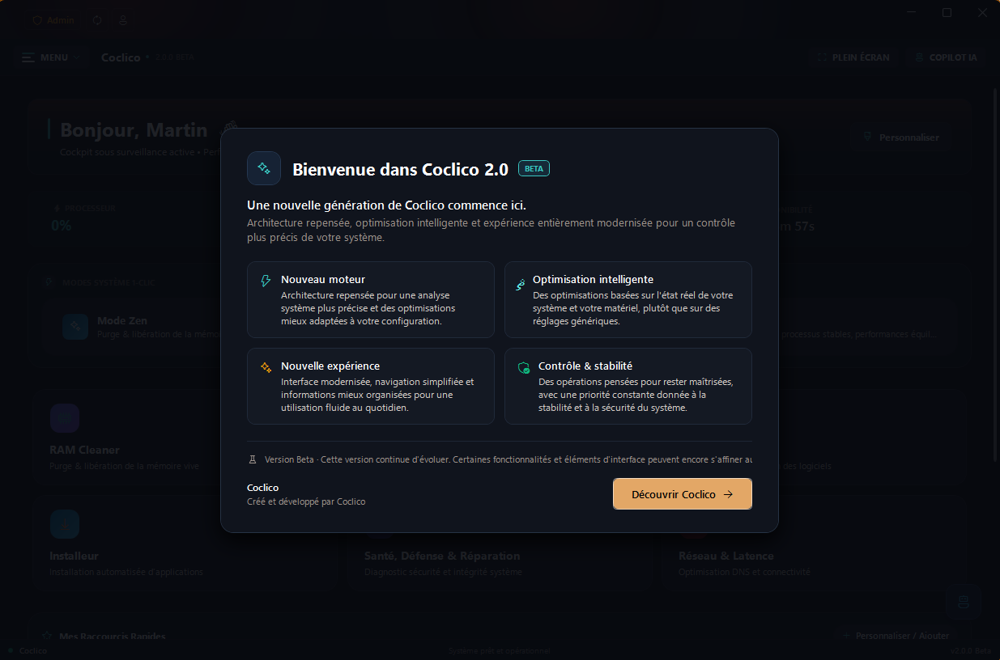
</p>

The application starts as a standard user: tools that need administrator rights ask for them exactly when needed, never at launch.

The main menu is a grouped accordion, inspired by Windows Settings: modules are organized into three collapsible sections (**Maintenance**, **Performance**, and **Applications**) that remember what you unfolded. Dashboard, Settings, and Help stay always visible.

| | |
| --- | --- |
| **Safety first** | Every destructive action asks for confirmation, deleted files go to the Recycle Bin, and network changes are protected by snapshots with one-click rollback. |
| **Hardware aware** | Power plans are created only through `powercfg`, with every setting validated against your actual PC before it is applied. |
| **Local AI** | A local GGUF model or a local Ollama server: no cloud keys, loopback addresses only. |

The project is actively being finished. Some tools require administrator rights, hardware-specific validation, or additional software. Read each action's description and confirmation before applying it.

## Features in detail

### Dashboard

<p align="center">
  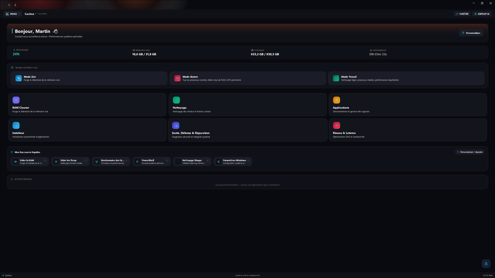
</p>

The home screen shows your system at a glance (CPU, memory, and disks), with shortcut tiles to every module. Three one-click modes combine memory cleaning and temp file cleanup:

- **Zen**: quick memory cleanup plus temporary files, for a light PC again.
- **Gamer**: deep memory purge before a gaming session.
- **Work**: standard memory cleanup, without touching files.

The visible tiles are customizable: you choose which shortcuts appear on your home screen.

### System cleaning

<p align="center">
  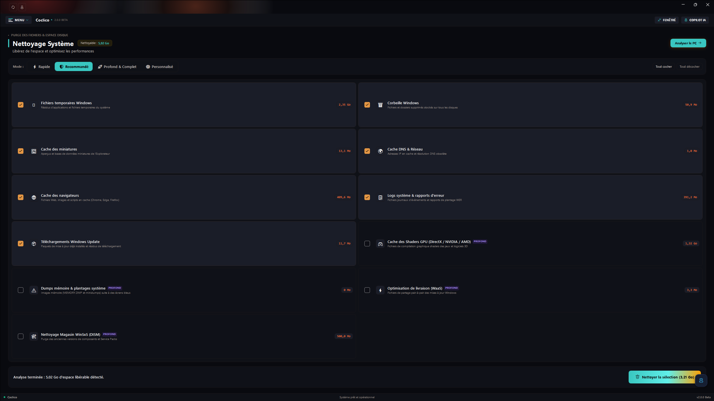
</p>

The module scans first, deletes second, and always with your confirmation. Covered categories:

- Windows temporary files;
- Recycle Bin;
- Thumbnail cache;
- Browser caches;
- System logs;
- DNS cache flush.

Presets select a whole set of categories in one click (quick or full cleanup). After each run, a summary reports the space freed and the number of files removed.

### Health and defense

<p align="center">
  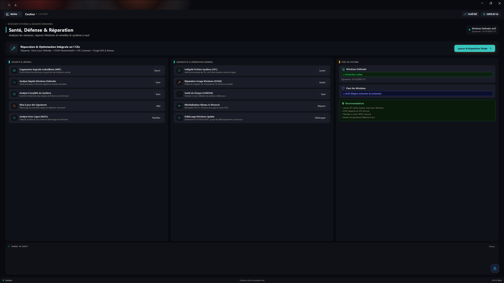
</p>

One central place for the security state of Windows:

- Windows Defender status and signature freshness;
- **One-click fix**: a guided sequence of checks and repairs, step by step, with cancellation at any time;
- Defender quick scan and full scan;
- Signature updates;
- Access to the Malicious Software Removal Tool (MSRT) and to Defender's offline scan (WDO);
- Windows startup health check.

### Disk usage

<p align="center">
  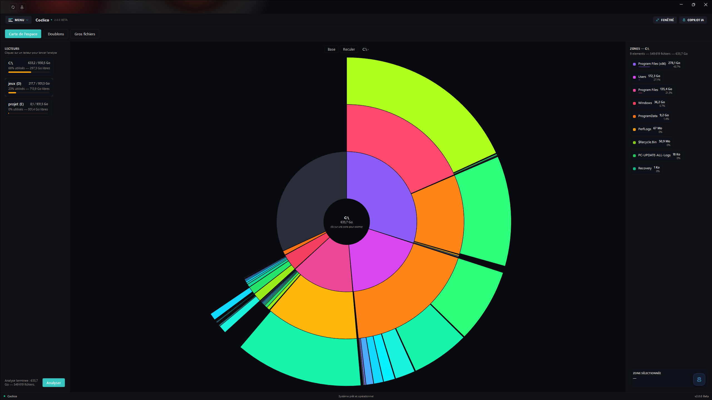
</p>

Three complementary modes to understand where your space goes:

- **Space map**: an interactive radial map of any drive or folder. Click a zone to zoom in, use the breadcrumb to go back, see the heaviest folders at a glance, and open any location in Explorer.
- **Duplicates**: the search runs in three phases (size, then a hash of the first 64 KB, then a full SHA-256 fingerprint): only files with *identical content* are listed. Threshold of 1, 10, 50, or 100 MB; groups sorted by recoverable space; per-file checkboxes; a "check copies (keep the first)" button; and deletion **to the Recycle Bin** with confirmation.
- **Largest files**: the top 50, 100, or 200 biggest files of a folder, with "open location" and per-file send-to-recycle-bin.

### RAM Turbo Cleaner

<p align="center">
  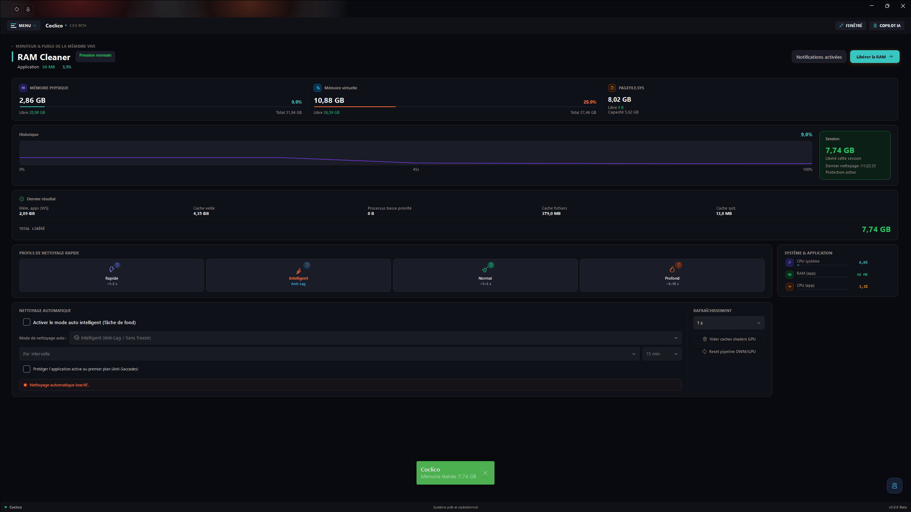
</p>

Monitor and purge your memory:

- Live view of physical memory, virtual memory (commit), and the page file (free / total);
- Manual purge with several profiles (quick, normal, deep, smart);
- History and total freed since the session started;
- **Smart automatic cleaning**: by interval, by usage threshold, or hybrid, protecting the foreground application so Coclico never purges what you are currently using.

### Network optimizer

<p align="center">
  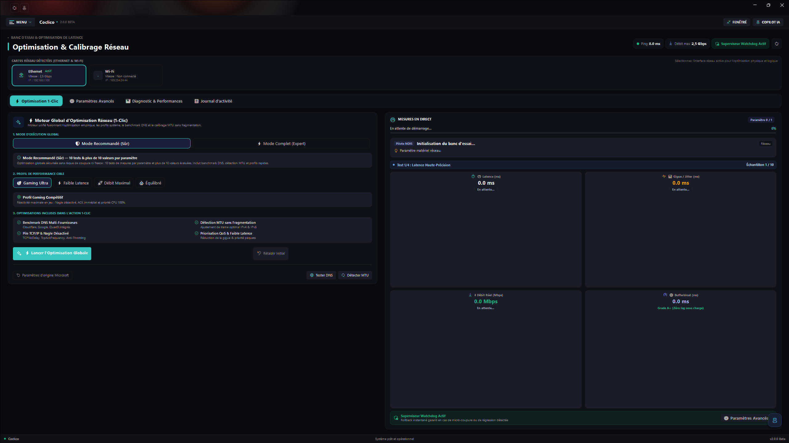
</p>

- Network adapter list with status, live ping and throughput, and a connection watchdog;
- Global optimizer: DNS, MTU, TCP settings (autotuning, RSS, RSC, timestamps, ECN, congestion provider), and QoS;
- **Every change is protected by a snapshot**: one-click rollback if a setting does not suit your adapter or driver;
- Performance measurements to compare before and after.

### CPU and power

<p align="center">
  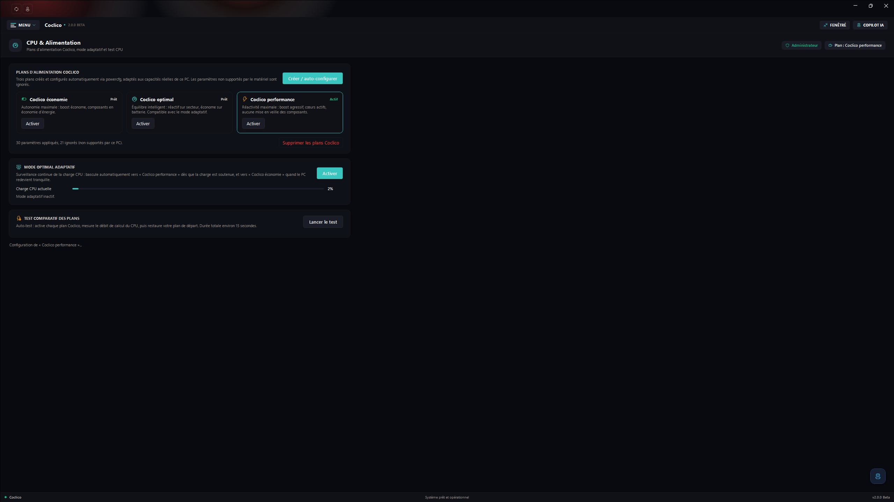
</p>

Three Coclico power plans, created and driven **only through powercfg** (no direct registry writes):

- **Coclico economy**: maximum battery life. Efficient boost, components in power-saving mode.
- **Coclico optimal**: responsive on AC power, frugal on battery. Compatible with the adaptive mode.
- **Coclico performance**: maximum responsiveness. Aggressive boost, active cores, no component sleep.

Key points of the module:

- **Auto-configured for your PC**: every setting (EPP, boost, frequency thresholds, USB, PCIe, Wi-Fi, display, disk, sleep…) is validated with `powercfg /q` before being applied; the ones your hardware does not support are skipped and counted.
- **Adaptive optimal mode**: Coclico watches CPU load and switches on its own to "performance" under sustained load, back to "economy" when the PC is idle again, with thresholds, sustained confirmation, and a cooldown between switches.
- **Comparative test**: measures CPU throughput under each of the three plans (about 15 seconds), displays the results as bars, highlights the best, and restores your original plan.
- The Coclico plans can be deleted at any time; Coclico then returns to the Windows Balanced plan. Administrator rights required.

### Programs

<p align="center">
  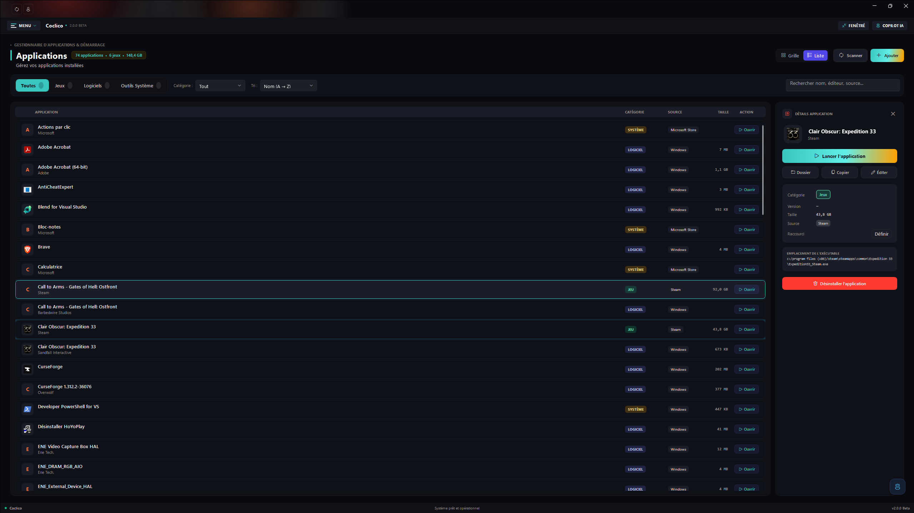
</p>

- Inventory of installed applications: scan, instant search, category filters, sorting, grid or list view;
- Clean uninstall through each application's own uninstaller, with confirmation;
- Add missing programs to the list.

### Winget installer

<p align="center">
  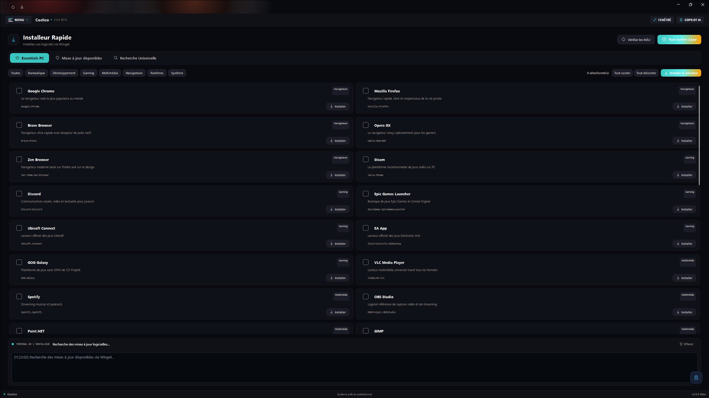
</p>

- Catalog of popular applications installable in one click through **Winget**;
- Automatic detection of packages already present on your machine (the button reads "Already installed");
- Coclico update checks from GitHub.

### Local AI assistant

<p align="center">
  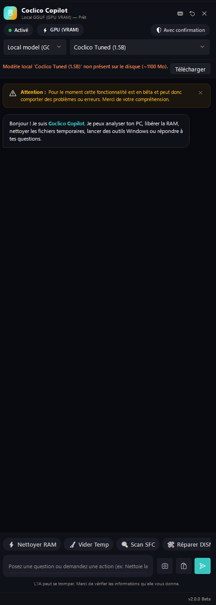
</p>

A built-in assistant, **100% local**, available from any module through the floating button or `Ctrl + Space`:

- Two engines to choose from: a **GGUF** model run by LLamaSharp (optional NVIDIA GPU acceleration, automatic CPU fallback), or a local **Ollama** server (`localhost` addresses only, remote servers rejected);
- Attach images (vision);
- The assistant knows which module you are on and can propose supported **Coclico actions**: every action is shown and confirmed before it runs;
- No cloud API keys: cloud providers and their key vault have been removed.

### Settings and profiles

- Interface language (French / English), theme and accent color, compact mode and font size;
- Launch with Windows and minimize to the notification area;
- AI settings: engine, model, GPU usage, and layer count;
- User profile with avatar (built-in cropping);
- Coclico update checks and installation.

The exact tools available depend on the Windows version, permissions, drivers, and installed components.

## Local AI and privacy

Coclico does not ask for, store, or use third-party AI API keys. On the first launch of this version, Coclico also removes the legacy encrypted API-key vault from the current Windows user profile, if it exists.

Downloading a GGUF model requires internet access once; inference runs locally afterward. Prompts and attached images are sent to the selected local inference engine. Coclico also makes network requests for functions such as checking GitHub releases and downloading model files.

Review the assistant's proposals before allowing it to change system settings. AI output can be incorrect; it does not replace your judgment or Windows documentation.

## Requirements

- Windows 11, version 22H2 or later (build 22621 or later).
- No separate .NET installation is required for official releases; the .NET 10 Desktop Runtime is included.
- Internet access to check for updates or download a model. The application can run a previously downloaded local model offline.
- Optional: Ollama installed and running locally.
- Optional: a compatible NVIDIA GPU and CUDA 12 runtime for GPU acceleration. CPU inference is available as a fallback, but speed depends on the computer and model.
- Enough available memory and disk space for the chosen model. GGUF model files are large and are not included in this repository.
- Some modules (power plans, installer, parts of cleaning and network) require administrator rights.

The current Windows x64 publish folder is about 1.6 GB before ZIP compression because it includes the optional CUDA runtime. The downloaded GGUF model is separate.

## Get Coclico

Open the [GitHub Releases](https://github.com/Coclico-cy/Coclico/releases) page and download `Coclico-<version>.exe` for the guided installer, or the Windows x64 ZIP for a portable folder install. Setup installs for the current Windows account, offers an optional desktop shortcut, and preserves Coclico settings and personal data when uninstalled. The standard setup omits the large optional CUDA runtime; choose the CUDA component only on a compatible NVIDIA system. The installer is not code-signed, so Windows may show a publisher warning.

The installer and portable ZIP include the .NET 10 Desktop Runtime, so no separate .NET installation is required. Releases include `SHA256SUMS.txt` checksums for both downloads.

To build the installer locally, simply run `./installer/build-installer.ps1`. The script publishes Coclico as a self-contained Windows x64 app when needed, compresses the payload, and produces the modern standalone installer in `artifacts/installer`.

## Keyboard shortcuts and tray

| Shortcut | Action |
| --- | --- |
| `F11` | Toggle full screen / windowed |
| `Ctrl` + `Space` | Open or close the AI assistant panel |

Coclico can also minimize to the notification area (enable it in Settings). Right-clicking the tray icon restores the window.

## Build from source

Install the .NET 10 SDK and use a Windows development environment with the Windows Desktop SDK:

```powershell
dotnet restore Coclico.slnx
dotnet build Coclico.slnx --configuration Release --no-restore
dotnet test Coclico.slnx --configuration Release --no-build --no-restore
dotnet format Coclico.slnx --verify-no-changes --no-restore
```

Open `Coclico.slnx` in Visual Studio or build it from PowerShell. To publish a self-contained Windows x64 folder:

```powershell
dotnet publish Coclico/Coclico.csproj `
  --configuration Release `
  --runtime win-x64 `
  --self-contained true `
  --output ./publish `
  -p:PublishSingleFile=false `
  -p:DebugSymbols=false `
  -p:DebugType=None
```

Details about the architecture, module anatomy, installer pipeline, and CI live in the [developer documentation](READMEDEV.md).

## Safety notes

- Some maintenance features can delete files or change Windows configuration. Confirm the selected categories and read the result summary.
- Network tuning writes settings that can depend on the network adapter and driver. Use the available snapshot and rollback features, and keep another way to restore connectivity.
- The power module only uses the `powercfg` command line (no direct registry writes), validates each setting against your hardware, and can delete the Coclico plans at any time.
- Administrator access is requested for operations that need it; declining elevation can make some features unavailable.
- Keep important data backed up. Coclico is not a replacement for Windows recovery tools or a backup system.
- Report a reproducible issue with Windows version, Coclico version, steps, and relevant sanitized logs. Never attach API keys, passwords, personal files, or unredacted diagnostic data.

## Project structure

```text
Coclico/                 WPF application
  Common/                Shared application services (core, UI, diagnostics, execution)
  Modules/               Dashboard, AI, cleaning, network, power, disk, settings, etc.
  Resources/             Themes, language dictionaries, and icons
Coclico.Installer/       Modern standalone WPF installer (SingleFile, animated)
Coclico.Tests/           Unit and XAML validation tests
installer/               Installer packaging and publishing scripts
docs/                    Screenshots used by the README files
.github/workflows/       Build, test, and release automation
README.md                English project documentation
README_FR.md             Documentation française
READMEDEV.md             Developer documentation (English)
READMEDEV_FR.md          Developer documentation (French)
```

## License

The project is licensed under the MIT License. You may use, copy, modify, merge, publish, distribute, sublicense, and sell copies of the project, provided you include the copyright and license notice. The license is in [LICENSE.txt](LICENSE.txt). Third-party dependencies and assets may have separate licenses; review their notices before redistributing them.
